  

  

  
    

 
    

 

## 🦅 The AlphaSys Directive

I am a Computer and Information Sciences undergraduate at **Siddaganga Institute of Technology (SIT)**. I build systems where hardware constraints, software logic, and real-world failure modes must all agree. 

What sets my background apart is execution across the stack—from silicon to script. Whether I am translating raw environmental sensor data into actionable signals or defending AI architecture to a judging panel, my focus is on building scalable, legible, and highly functional engineering solutions.

### ⚡ Current Focus & Active Execution
*   **Backend & Systems:** Deepening backend engineering skills through structured coursework, with AI integration as the next deliberate step. 
*   **Algorithmic Rigor:** Active member of **GeeksforGeeks**, daily cross-referencing platform solutions against personal implementations to sharpen efficiency and code readability.
*   **Building in Public:** Recently completed the **100 Days of Python Challenge**—a public, daily discipline of shipping everything from automation tools to real-world scripts.

---
## 🛠️ Technical Arsenal 
I do not build frontends. I build systems, memory-safe environments, and hardware logic.

| Domain | Technologies / Focus |
| :--- | :--- |
| **Core Languages** | Python, C++, C, JavaScript |
| **Engineering & Logic** | Data Structures & Algorithms, Object-Oriented Programming (OOP), System Design |
| **Hardware & IoT** | Microcontrollers, ESP32, Arduino Nano, Embedded Systems |
| **Tools & Infrastructure** | Git/GitHub, LaTeX/Overleaf, Technical Documentation |

I do not build frontends. I build systems, memory-safe environments, and hardware logic.

  

 

---

## 🏆 Featured Builds & Architecture

### 1. 100 Days of Python — 
A completed, public log of 100 days of daily Python builds. This repository contains scalable automation scripts, small tools, and real applications. Every project is documented and committed—a verifiable record of applied, disciplined Python engineering.

### 2. Fruit Health Monitoring System — 
A team-built freshness monitoring system utilizing an Arduino Nano and environmental sensors. Focused heavily on hardware-to-logic thinking, I translated raw sensor data into real-time freshness signals. The full system design and sensor logic are documented end-to-end.

### 3. NeuroTrace AI — 
Conceptualized an AI-driven system model from architecture through implementation logic. I presented and successfully defended the project framework and technical reasoning live at a collegiate Pitchathon.

---

## 🌎 Community & Leadership

Outside of pure build time, I manage real people and outreach:
*   **Board of Directors, Lions Club International (Tumakuru):** Directing community initiative planning and managing operational logistics for local service projects.
*   **College Ambassador, Unlox Academy:** Building a student community around career-readiness initiatives and acting as the direct communication bridge for industry-relevant learning pathways.

---

## 📊 Execution Metrics

  
  

  

  <picture>
    <source media="(prefers-color-scheme: dark)" srcset="https://raw.githubusercontent.com/komal-r-aradhya-dev/komal-r-aradhya-dev/output/github-contribution-grid-snake-dark.svg">
    <source media="(prefers-color-scheme: light)" srcset="https://raw.githubusercontent.com/komal-r-aradhya-dev/komal-r-aradhya-dev/output/github-contribution-grid-snake.svg">
    
  </picture>

 

